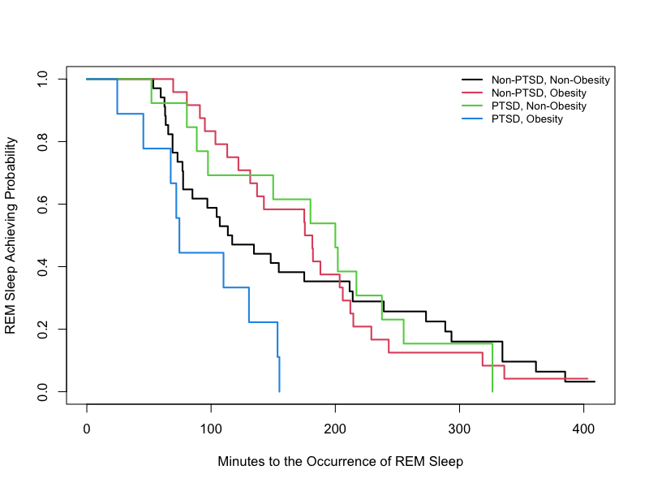

```{r setup, include=FALSE}
knitr::opts_chunk$set(echo = F,message=FALSE,warning=FALSE)
```

```{r}
library(table1)
library(arsenal)
library(survival)
library(survMisc)
library(KMsurv)
library(MASS)

load("../Dataset/clean_data.rda")
```

# Introduction

The study recruited 82 veteran twin pairs (a total of 164 veterans). Each subject had a clinical diagnosis of PTSD. All of them underwent one-night in-lab polysomnography (PSG) for objective sleep monitoring. In this study, different twin pairs came to visit on different dates, so the visit date can be used to identify twin pairs. Additionally, investigators have collected covariates, such as body mass index (BMI), diabetes history, hypertension history, high blood cholesterol history, marital status, employment status, and education levels, which were considered to be potentially important in the investigation of the relationship between PTSD and sleep architecture and disturbance. In particular, the investigators believed that being obese may modify the relationship between PTSD and sleep architecture/sleep disturbance. 


# Data Analysis

The marginal association between time-to-event and each covariate was summarized in Table 1). Except for predetermined confounding effects of BMI/ Obesity status, diabetes history (DM) and hypertension history (HTN), no other confounders showed marginal survival differences in univariate analysis. The marginal Kaplan-Meier plots (Figure 1) also justified this phenomenon. 

```{r}
fit = coxph(Surv(OREM, censor) ~ PTSD + BMI_grp + PTSD:BMI_grp + HTN + DM, data=dat3)

# hypothesis test for Obesity status stratification
walds <-  function(est,var,C){
  df = nrow(C)
  Ccov = C%*%var%*%t(C)
  X.w = t(C%*%est)%*%ginv(Ccov)%*%(C%*%est) #test.stat
  pval = 1-pchisq(X.w,df)
  es = (C%*%est)
  low = (C%*%est)+sqrt(Ccov)%*%qnorm(0.025)
  up  = (C%*%est)+sqrt(Ccov)%*%qnorm(0.975)
  res = c(exp(es),exp(low),exp(up),pval)
  names(res) = c("HR","HRlower","HRuppper","P-value")
  return(res)
}

# Non-Obesity: PTSD v.s. non-PTSD
Cs <- rbind(c(1,0,0,0,0))
w1 <- walds(est=fit$coefficients,var=fit$var,C=Cs)
w1 <- round(w1, 3)
# Obesity:  PTSD v.s. non-PTSD
Cs <- rbind(c(1,0,0,0,1))
w2 <- walds(est=fit$coefficients,var=fit$var,C=Cs)
w2 <- round(w2, 3)
# Difference between associations
Cs <- rbind(c(0,0,0,0,1))
w3 <- walds(est=fit$coefficients,var=fit$var,C=Cs)
w3 <- round(w3, 3)
```

The final stratified Obesity-included Cox-PH model was: (Table 2)
$$h(t|\mathbf{X})=h_0(t)exp{-0.215\times PTSD-0.176\times Obese+1.521\times PTSD\times Obese-0.039\times HTN+0.448\times DM}$$

Adjusting for hypertension and diabetes history, among non-obese patients, the relative risk of having REM sleep of PTSD patients compared to non-PTSD patients was `r w1[1]` (95% CI: `r w1[2]`–`r w1[3]`). Adjusting for hypertension and diabetes history, among obese patients, the relative risk of having REM sleep of PTSD patients compared to non-PTSD patients was `r w2[1]` (95% CI: `r w2[2]`–`r w2[3]`). We referred to them as the confounder-adjusted association between PTSD and time to the occurrence of REM sleep stratified by obesity status. The difference between two association was statistically significant (p=`r w3[4]`). It implied that among non-obese group, PTSD patients were not significantly associated with shorter time to the occurrence of REM sleep. However, among obese group, PTSD patients were more likely to have shorter time to the occurrence of REM sleep. The association in obese patients was significantly different from the association in non-obese patients.


\newpage
# Appendix Tables/Figures
```{r summary-table}
tab <- as.matrix(read.csv("../Tables/table1.csv"))

options(knitr.kable.NA = '')
knitr::kable(tab,
             caption = "Table 1. Summary Statistics by Cox-PH Model with Respect to Categorical Covariate")
```

```{r fit-table}
tab2 <- as.matrix(read.csv("../Tables/table2.csv",row.names=1))

options(knitr.kable.NA = '')
knitr::kable(tab2,
             caption = "Table 2. Model Fitting Results for Obesity-included Cox-PH Regression Model")
```


```{r km-plot, fig.align='center', fig.cap="Figure 1. Kaplan-Meier Plot"}


```


